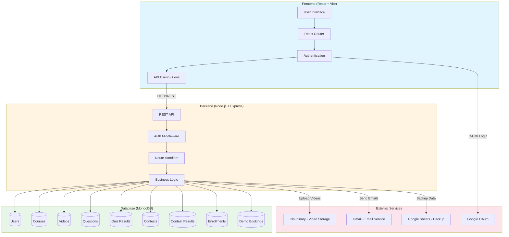
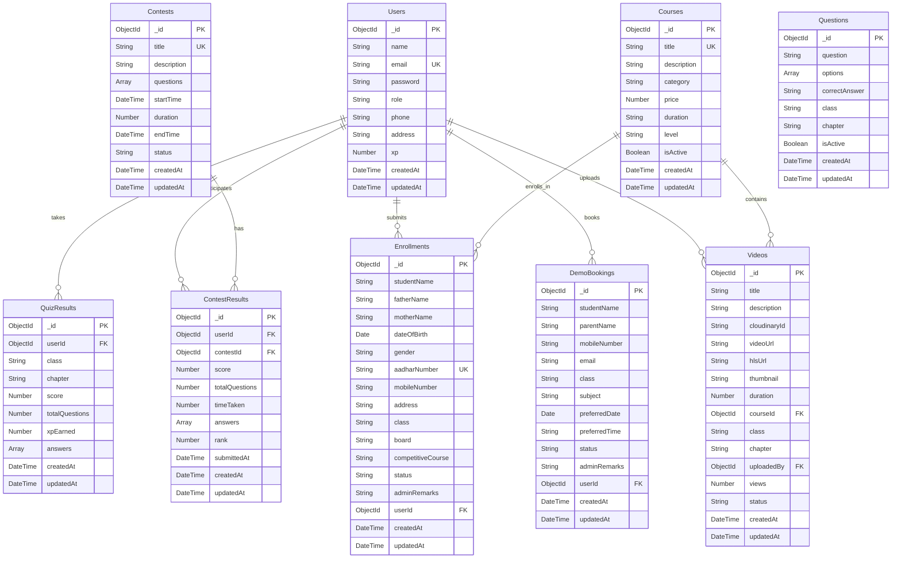

# Success Mantra Institute

A complete web platform for coaching institute management built with React and Node.js. This application handles everything from student enrollment to video lectures, quizzes, and contests.

## Architecture Diagram



## Database Schema



## What This Project Does

This is a full-featured coaching institute website where students can enroll in courses, watch video lectures, take quizzes, and participate in contests. Admins can manage everything through a dedicated dashboard.

## Main Features

### For Students
- Create account with email or Google
- Browse available courses
- Watch video lectures (stored on Cloudinary)
- Take chapter-wise quizzes and earn XP
- Participate in timed contests
- View leaderboards and rankings
- Track progress and quiz history
- Book free demo classes
- Submit enrollment forms

### For Admins
- Manage student enrollments
- Upload and organize video lectures
- Create quizzes with bulk upload (Excel/CSV)
- Schedule and manage contests
- Review demo booking requests
- Update enrollment status with remarks
- View statistics and analytics
- Automatic data backup to Google Sheets

## Technology Stack

### Frontend
- React 18 with Vite
- React Router for navigation
- Axios for API calls
- Context API for state management
- CSS3 for styling

### Backend
- Node.js with Express
- MongoDB for database
- JWT for authentication
- Cloudinary for video storage
- Nodemailer for emails
- Google Sheets API for data backup
- Multer for file uploads

## Getting Started

### What You Need
- Node.js (version 16 or higher)
- MongoDB (running locally or cloud)
- Cloudinary account (for videos)
- Gmail account (for sending emails)
- Google Cloud account (optional, for Sheets integration)

### Installation Steps

1. Clone this repository
```bash
git clone https://github.com/Mishra-coder/Coaching_Website.git
cd Coaching_Website
```

2. Install backend dependencies
```bash
cd backend
npm install
```

3. Install frontend dependencies
```bash
cd frontend
npm install
```

4. Setup backend environment variables

Create `backend/.env` file:
```env
PORT=5001
MONGODB_URI=mongodb://localhost:27017/success-mantra
JWT_SECRET=your-secret-key-here
JWT_EXPIRE=7d

FRONTEND_URL=http://localhost:3000

EMAIL_USER=your-gmail@gmail.com
EMAIL_PASSWORD=your-gmail-app-password
ADMIN_EMAIL=admin-email@gmail.com

CLOUDINARY_CLOUD_NAME=your-cloud-name
CLOUDINARY_API_KEY=your-api-key
CLOUDINARY_API_SECRET=your-api-secret

GOOGLE_CLIENT_ID=your-google-client-id
GOOGLE_CLIENT_SECRET=your-google-client-secret
GOOGLE_CALLBACK_URL=http://localhost:5001/api/auth/google/callback
```

5. Setup frontend environment variables

Create `frontend/.env.local` file:
```env
VITE_API_URL=http://localhost:5001/api
VITE_GOOGLE_CLIENT_ID=your-google-client-id
```

6. Start the backend server
```bash
cd backend
npm run dev
```

7. Start the frontend (in a new terminal)
```bash
cd frontend
npm run dev
```

The app will open at `http://localhost:3000`

## Project Structure

```
Coaching_Website/
├── frontend/
│   ├── public/              # Static assets
│   ├── src/
│   │   ├── components/      # React components
│   │   │   ├── Admin/       # Admin dashboard components
│   │   │   ├── About.jsx
│   │   │   ├── AdmissionForm.jsx
│   │   │   ├── Contests.jsx
│   │   │   ├── DemoBooking.jsx
│   │   │   ├── Home.jsx
│   │   │   ├── Login.jsx
│   │   │   ├── Navbar.jsx
│   │   │   ├── Profile.jsx
│   │   │   ├── Quiz.jsx
│   │   │   ├── SignUp.jsx
│   │   │   └── Videos.jsx
│   │   ├── context/         # React Context
│   │   ├── services/        # API service layer
│   │   ├── assets/          # Images and icons
│   │   ├── App.jsx          # Main app component
│   │   └── index.css        # Global styles
│   ├── index.html
│   ├── package.json
│   └── vite.config.js
│
├── backend/
│   ├── config/              # Configuration files
│   │   ├── cloudinary.js    # Cloudinary setup
│   │   ├── db.js            # MongoDB connection
│   │   └── googleAuth.js    # Google OAuth setup
│   ├── middleware/          # Express middleware
│   │   └── auth.js          # JWT authentication
│   ├── models/              # MongoDB schemas
│   │   ├── Contest.js
│   │   ├── ContestResult.js
│   │   ├── Course.js
│   │   ├── DemoBooking.js
│   │   ├── Enrollment.js
│   │   ├── Question.js
│   │   ├── QuizResult.js
│   │   ├── User.js
│   │   └── Video.js
│   ├── routes/              # API routes
│   │   ├── authRoutes.js
│   │   ├── contestRoutes.js
│   │   ├── courseRoutes.js
│   │   ├── demoBookingRoutes.js
│   │   ├── enrollmentRoutes.js
│   │   ├── questionRoutes.js
│   │   ├── quizRoutes.js
│   │   └── videoRoutes.js
│   ├── utils/               # Utility functions
│   │   ├── email.js         # Email notifications
│   │   ├── emailResubmit.js # Resubmission emails
│   │   └── googleSheets.js  # Google Sheets integration
│   ├── uploads/             # Temporary file storage
│   ├── server.js            # Express server
│   └── package.json
│
├── .gitignore
└── README.md
```

## How to Use

### Admin Access
To access admin features, use the secret key `admin123` when signing up or logging in.

### Uploading Videos
1. Login as admin
2. Go to Admin Dashboard → Video Manager
3. Click "Upload Video"
4. Select video file, add title and description
5. Video will be uploaded to Cloudinary automatically

### Creating Quizzes
1. Go to Admin Dashboard → Question Manager
2. Either add questions manually or bulk upload via Excel/CSV
3. Questions will be available for students immediately

### Managing Contests
1. Go to Admin Dashboard → Contest Manager
2. Create contest with title, duration, and start time
3. Add questions manually or bulk upload
4. Students can participate during the contest window

## Cloudinary Setup

1. Create account at https://cloudinary.com
2. Get your credentials from dashboard:
   - Cloud Name
   - API Key
   - API Secret
3. Add these to `backend/.env`
4. Videos will automatically upload to cloud storage

## Google Sheets Integration (Optional)

This feature automatically backs up user signups and enrollments to Google Sheets.

1. Create a Google Cloud project
2. Enable Google Sheets API
3. Create a Service Account and download JSON key
4. Share your Google Sheet with the service account email
5. Add credentials to `backend/.env`

## API Endpoints

### Authentication
- `POST /api/auth/register` - Create new account
- `POST /api/auth/login` - Login
- `POST /api/auth/admin-register` - Admin signup
- `GET /api/auth/me` - Get current user
- `PUT /api/auth/profile` - Update profile

### Videos
- `GET /api/videos` - Get all videos
- `GET /api/videos/:id` - Get single video
- `POST /api/videos/upload` - Upload video (admin)
- `DELETE /api/videos/:id` - Delete video (admin)

### Quizzes
- `GET /api/questions` - Get questions by class/chapter
- `POST /api/quiz/submit` - Submit quiz answers
- `GET /api/quiz/history` - Get user quiz history

### Contests
- `GET /api/contests` - Get all contests
- `GET /api/contests/active` - Get active contests
- `POST /api/contests/:id/submit` - Submit contest
- `GET /api/contests/:id/leaderboard` - Get rankings

### Enrollments
- `POST /api/enrollments` - Submit enrollment form
- `GET /api/enrollments` - Get all enrollments (admin)
- `PUT /api/enrollments/:id/status` - Update status (admin)

## Database Schema

### User
- name, email, password (hashed)
- role (student/admin)
- phone, address
- timestamps

### Video
- title, description
- cloudinaryId, videoUrl, hlsUrl
- thumbnail, duration
- uploadedBy, views, status

### Question
- question, options (array)
- correctAnswer
- class, chapter
- isActive

### Contest
- title, description
- questions (array)
- startTime, duration, endTime
- status

### Enrollment
- studentName, fatherName, motherName
- dateOfBirth, gender, aadharNumber
- mobileNumber, address
- class, board, competitiveCourse
- status, adminRemarks

## Environment Variables

### Backend Required
- `PORT` - Server port (default: 5001)
- `MONGODB_URI` - MongoDB connection string
- `JWT_SECRET` - Secret key for JWT tokens
- `FRONTEND_URL` - Frontend URL for CORS
- `EMAIL_USER` - Gmail for sending emails
- `EMAIL_PASSWORD` - Gmail app password
- `CLOUDINARY_CLOUD_NAME` - Cloudinary cloud name
- `CLOUDINARY_API_KEY` - Cloudinary API key
- `CLOUDINARY_API_SECRET` - Cloudinary API secret

### Frontend Required
- `VITE_API_URL` - Backend API URL
- `VITE_GOOGLE_CLIENT_ID` - Google OAuth client ID

## Development

### Backend Development
```bash
cd backend
npm run dev
```
Server runs on http://localhost:5001

### Frontend Development
```bash
cd frontend
npm run dev
```
App runs on http://localhost:3000

### Building for Production

Frontend:
```bash
cd frontend
npm run build
```

Backend is production-ready as-is.

## Common Issues

### Videos not uploading
- Check Cloudinary credentials in `.env`
- Verify file size is under 500MB
- Check internet connection

### Emails not sending
- Use Gmail app password, not regular password
- Enable "Less secure app access" in Gmail settings
- Check EMAIL_USER and EMAIL_PASSWORD in `.env`

### MongoDB connection failed
- Make sure MongoDB is running
- Check MONGODB_URI in `.env`
- Verify database name is correct

## Contributing

Feel free to fork this project and submit pull requests. For major changes, please open an issue first.

## License

This project is for educational purposes.

## Author

Devendra Mishra  
GitHub: [@Mishra-coder](https://github.com/Mishra-coder)

---

Built with ❤️ for Success Mantra Institute
